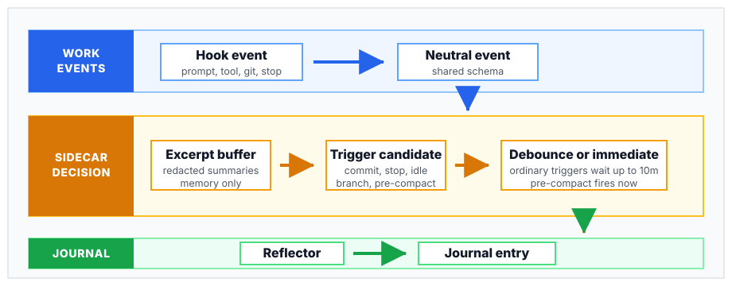
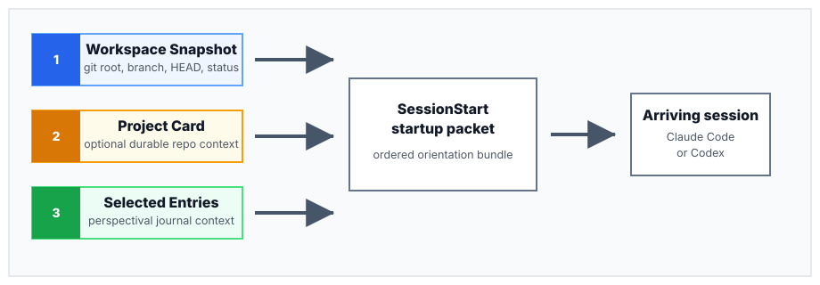
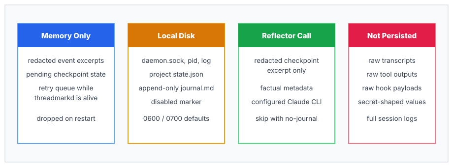

# How Threadmark Works

Threadmark is a shared continuity layer for software developers who hand work
off between Claude Code and Codex in the same repository.

Mechanically, it is a local event-to-journal pipeline. It receives live work events through harness hooks, identifies moments worth preserving, and writes short journal entries that can orient a later session.

This document explains the mechanics.

## The Short Version

At a glance, Threadmark has three phases: a coding session emits hook events, the sidecar decides what is worth preserving, and a future session receives the resulting startup packet.


Threadmark does not replace the harness, run the coding agent, or store full transcripts. It runs beside the harness and preserves a compact continuity layer.

## Main Components

```text
cmd/threadmark             user CLI and hook bridge
cmd/threadmarkd            long-running daemon
internal/adapters/*        Claude Code and Codex payload translators
internal/core              event schema, thread boundaries, triggers, debounce
internal/daemon            per-project ingest, state, excerpts
internal/ipc               Unix-socket NDJSON transport
internal/journal           project hash, state path, journal frontmatter/store
internal/reflector         prompt loading, redaction, Claude CLI subprocess
internal/reflector/default_prompt.md embedded default reflector prompt
adapters/*/hooks           shell shims installed into harness config
prompts/reflector.md       source-checkout reflector prompt override
```

The split matters: hooks stay small and fast; the daemon does the stateful work.

## Install Layout

`threadmark install` copies the CLI and daemon into a bin directory. The default is user-local:

```text
~/.local/bin/threadmark
~/.local/bin/threadmarkd
```

The hook bridge starts `threadmarkd` by looking for a sibling daemon binary first, then falling back to `threadmarkd` on `PATH`. This keeps normal installs source-free: project hooks call `threadmark`, and `threadmark` can find the daemon without knowing where the original checkout lived.

## 1. Hooks Observe Harness Events

Claude Code and Codex expose hook events such as:

- `SessionStart`
- `UserPromptSubmit`
- `PostToolUse`
- `Stop`
- `PreCompact`
- `PostCompact`

Threadmark's project activation command installs default command hooks into the harness config:

```sh
threadmark activate
```

Lower-level harness-specific commands are also available: `threadmark init claude-code` and `threadmark init codex`.

The installed hook calls a small shell shim. The shim locates `threadmark` using:

1. `THREADMARK_BIN`
2. `threadmark` on `PATH`
3. repo-local `bin/threadmark` or `./threadmark` for development checkouts

The shim then runs:

```sh
threadmark hook claude-code
```

or:

```sh
threadmark hook codex
```

The hook bridge reads the harness JSON payload from stdin.

## 2. Adapters Translate to Neutral Events

Each harness has its own hook payload shape. Threadmark translates those payloads into a shared core event schema.

Core event fields include:

- schema version
- event id
- timestamp
- harness name
- transcript id
- working directory
- event kind
- typed payload

Event kinds include:

- text
- tool call
- tool result
- file change
- working directory change
- tool definition

Adapters also summarize tool activity. For example, a file write becomes a file-change event, and a `git commit` command can become a file-change event with a commit reference. Raw tool inputs and full outputs are not preserved as journal material.

## 3. The Hook Bridge Sends Events to the Daemon

The hook bridge forwards translated events to:

```text
~/.threadmark/daemon.sock
```

The transport is newline-delimited JSON over a Unix-domain socket.

If the daemon is not reachable, the hook bridge auto-starts `threadmarkd`. A lock file prevents several simultaneous hook events from racing to start multiple daemons.

The hook bridge is allowed to fail quietly in normal mode because it sits inside the agent harness path. In strict test mode, failures can be surfaced as non-zero exits.

On `SessionStart`, startup packet generation is best-effort. If daemon startup or event forwarding fails, Threadmark logs the hook error but still emits the read-only startup packet when the local journal and workspace snapshot are available.

## 4. The Daemon Owns Project State

`threadmarkd` is a per-user process. It keeps in-memory state and writes durable project state under:

```text
~/.threadmark/projects/<project-hash>/state.json
```

Project identity is derived from the resolved working directory. Threadmark uses the first 16 hex characters of a SHA-256 hash of that path. Existing 8-character project directories are reused only when their saved state records the same resolved working directory.

The state file tracks:

- current thread id
- transcript-to-thread mapping
- last harness and transcript
- last activity
- last checkpoint
- pending debounce trigger
- source event range metadata

On daemon restart, transient checkpoint state is dropped. This is deliberate: the in-memory redacted event excerpt buffer is not persisted, so the daemon must not write a journal entry from a checkpoint whose source excerpt is gone.

## 5. Threads Are Continuity Units

A Threadmark thread is not the same as a harness transcript.

A transcript is one harness session artifact. A thread is the line of work Threadmark thinks is still continuous.

Thread boundaries currently happen when:

- there is no current thread yet
- activity resumes after a 24-hour gap
- the working directory changes
- the user gives a new-thread signal such as `/threadmark:new-thread`

One thread can span multiple Claude Code and Codex sessions if they happen in the same project and line of work.



## 6. Triggers Decide When to Checkpoint

Threadmark does not write a journal entry for every event. It waits for checkpoint triggers.

Current trigger types:

- **user checkpoint**: a user prompt beginning with `/checkpoint`, `/threadmark:checkpoint`, or `threadmark checkpoint`
- **commit**: a git commit detected from tool activity
- **branch switch**: a working-directory change event
- **stop**: session stop after substantive work
- **idle**: inactivity after recent work
- **safety net**: many user turns since the last checkpoint
- **pre-compact**: harness context compaction is about to happen

Substantive work includes user prompts, tool calls/results, file changes, working-directory changes, and tool definitions. A lifecycle-only session, such as start then stop, should not create a journal entry.

## 7. Debounce Keeps Entries Coherent

Most triggers do not write immediately. They enter a debounce window, currently 10 minutes by default.

During the window:

- a higher-priority trigger can replace a pending trigger
- a lower-priority trigger can be skipped
- related work can be included in one source range
- when the pending trigger becomes due, a checkpoint is fired

The purpose is to avoid several tiny entries for one logical unit of work.

Session stop and pre-compaction are different. They fire immediately after substantive work. Stop is the handoff boundary when a harness session ends. Pre-compaction is immediate because the harness is about to rewrite or compress its context. If another trigger is pending, the immediate checkpoint absorbs it into the same source range.

## 8. The Daemon Builds a Redacted Excerpt

The daemon keeps an in-memory buffer of event summaries. These summaries are the source material for reflection.

Examples of summaries:

```text
- user said: proceed methodically
- tool call "apply_patch" correlation_id=... args=<omitted>
- tool result correlation_id=... status=success summary=...
- file modify cmd/threadmark/hook.go source=tool commit=
```

Redaction happens before the reflector prompt is built. Current redaction covers common token and secret patterns, including GitHub tokens, OpenAI-style keys, Anthropic keys, bearer tokens, environment-style `TOKEN`, `SECRET`, `PASSWORD`, `API_KEY`, and `KEY` assignments, structured secret fields, npm auth tokens, and private-key blocks. Redaction is best effort, not a security guarantee.

Raw hook payloads and raw tool outputs are not persisted into the journal.

## 9. The Reflector Writes the Journal Body

When a checkpoint fires, `threadmarkd` calls the reflector unless no-journal mode is active.

The current reflector implementation runs the Claude CLI. In the default convenience mode, it is effectively:

```sh
claude --settings '{"disableAllHooks":true}' -p <prompt>
```

In bare mode, it is:

```sh
claude --bare -p <prompt>
```

The installed daemon includes an embedded default reflector prompt. A source checkout can override it with `prompts/reflector.md` or an explicit `--reflector-prompt` path.

The reflector subprocess also receives:

```text
THREADMARK_REFLECTOR_ACTIVE=1
```

Threadmark hooks no-op under that marker. This prevents the reflector's own model call from recursively creating more Threadmark events.

The reflector receives:

- the reflector prompt
- checkpoint metadata
- the redacted event excerpt

It returns only the journal body. The daemon writes factual frontmatter itself.

Reflector calls are bounded by a timeout and a small concurrency limit. Timeout and backoff events are logged separately so a stalled reflector is visible during diagnosis.

If checkpoint handling fails, Threadmark schedules an in-memory retry with capped exponential backoff. The retry queue holds the already-redacted checkpoint excerpt only while `threadmarkd` remains alive. It is not written to disk, so a daemon crash or machine restart can still lose a failed pending checkpoint.

## 10. Journal Entries Have Two Parts

The journal is an append-only Markdown file:

```text
~/.threadmark/projects/<project-hash>/journal.md
```

Each entry has frontmatter plus body.

The daemon writes frontmatter fields such as:

- entry id
- thread id
- transcript id
- trigger
- timestamp
- source event range
- harness
- working directory
- files touched
- commit refs
- reflector backend
- reflector mode
- reflector model metadata
- reflector prompt hash
- Threadmark version

The reflector writes the body. The body is intentionally first-person because it is meant to preserve working perspective: what the agent was trying to do, what mattered, what was brittle, and what the next session should know first.

If a checkpoint has no useful continuity value, the reflector prompt asks for stable marker phrases such as "nothing to hand off" or "plumbing artifact." Startup surfacing can then omit those entries without adding semantic retrieval. If every recent entry has a low-signal marker, Threadmark still includes the most recent entry as a labeled fallback rather than sending an empty handoff.

## 11. SessionStart Produces a Startup Packet

When a new Claude Code or Codex session starts, the hook bridge can write additional context back to the harness.

Threadmark's startup packet has three possible layers.



The terms are intentional: `startup packet` is the whole SessionStart artifact. `Workspace Snapshot`, `Project Card`, and selected `Entry` sections are parts of that packet. Threadmark does not have a separate "startup card" primitive.

First, a Workspace Snapshot:

```text
## Workspace Snapshot

working_dir: /home/you/code/project
git_root: /home/you/code/project
branch: main
head: 4f3a91c
status: dirty (2 paths)
dirty_path: M src/session.ts
dirty_path: ?? notes/repro.md
```

This is best-effort. If git is missing, the directory is not a git repo, or a command times out, the snapshot is omitted.

Second, an optional Project Card:

```text
## Project Card

source: THREADMARK.md

canonical_name: Threadmark
purpose: Local handoff and continuity for coding agents.
validation_gates: go test ./...; go vet ./...; git diff --check
```

The Project Card is durable, project-authored context. Threadmark checks `THREADMARK_PROJECT_CARD`, `.threadmark/project-card.md`, and `THREADMARK.md` at the git root. It reads the card but never writes or updates it.

Third, selected recent journal entries:

- scan a recent window, currently 12 entries by default
- omit entries with self-declared low-signal marker phrases
- inject up to 3 selected entries
- show compact provenance: `entry_id | timestamp | harness | trigger`
- show the reflector-written body

The packet tells the receiving agent that journal entries are perspective, not ground truth. The Workspace Snapshot and Project Card are factual/durable context; the journal entries are orientation claims to verify against code, tests, git history, and durable docs.

## 12. Storage and Privacy Boundaries



Default storage:

```text
~/.threadmark/
  daemon.sock
  daemon.pid
  daemon.log
  projects/
    <project-hash>/
      state.json
      journal.md
```

Project opt-out marker:

```text
<project>/.threadmark/disabled
```

Default permissions:

- directories: `0700`
- files: `0600`

Privacy boundaries:

- no raw transcript persistence
- no raw tool output persistence
- reflector input is redacted on a best-effort basis
- transient event excerpts are memory-only
- daemon restart drops pending checkpoint state if the excerpt is gone
- project disable is checked before forwarding events
- purge commands remove local project or root storage

Threadmark is still a local tool that sends a redacted excerpt to the configured reflector model. Users should treat journal mode as a model-call path, treat redaction as best effort, and use no-journal mode for sensitive sessions.

## 13. No-Journal Mode

No-journal mode disables reflector calls and journal writes:

```sh
THREADMARK_NO_JOURNAL=true claude
```

This affects the daemon started by that command. If a daemon is already running, stop or restart it with the desired environment.

The daemon still ingests events and logs trigger decisions. This is useful for testing whether Threadmark would have checkpointed without sending excerpts to the reflector.

It also supports the v0 falsification protocol: compare sessions with journal context against sessions where journal writes are suppressed.

## 14. What Threadmark Does Not Do

Threadmark does not:

- replace `/resume`
- make claims authoritative
- store complete transcripts
- perform semantic search
- sync journals across machines
- coordinate a team through a server
- install harness-native slash commands
- include OpenCode or Pi adapters

Those are outside the current v0 focus, which is local, same-workspace continuity.

## 15. Why This Shape

Threadmark keeps three layers separate:

- **third-person trace**: hook events, git facts, tool summaries, state files
- **first-person perspective**: journal bodies written by the reflector
- **durable truth**: code, tests, commits, and project docs

The journal is useful only if it helps an arriving session orient faster without pretending to be authoritative. That is the core design constraint behind the daemon, reflector, and startup packet.
