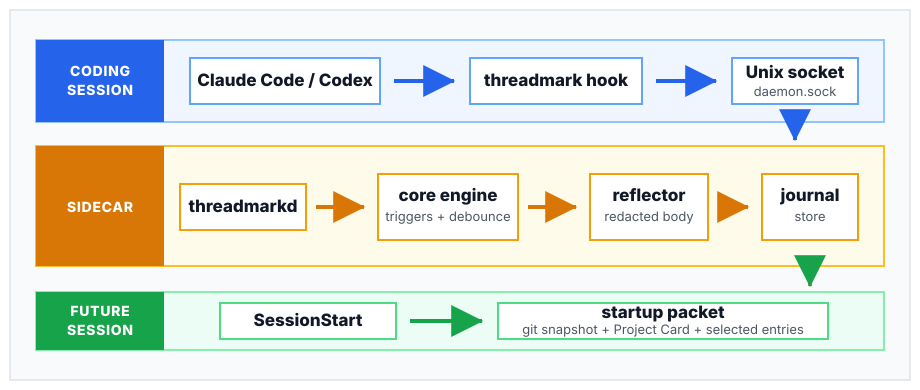

# Threadmark

[](./go.mod)
[](https://github.com/thinkwright/threadmark/actions/workflows/ci.yml)
[](https://github.com/thinkwright/threadmark/releases/latest)
[](https://github.com/thinkwright/homebrew-tap)
[](./LICENSE)
[](#limits)
[](#what-it-does)
[](#limits)

Threadmark is a shared continuity substrate for software developers who work
simultaneously with Claude Code and Codex in the same repository.

Claude Code and Codex can keep their own interfaces, models, transcripts,
assumptions, and working styles. Threadmark's sidecar runs beside them, receives
live work events through hooks, accumulates activity while work is active, holds
a pending checkpoint until the work reaches a useful boundary, writes a short
journal entry when that checkpoint fires, and gives the next agent a compact
startup packet for the same project.

It is not a transcript archive, semantic search layer, or general agent memory
system. Threadmark is narrower: it preserves enough situated context for
independent agents to stay on the same line of work without inheriting one
another's entire sessions.

## How It Works

Each harness keeps doing the coding work. Threadmark receives live work events
through Claude Code or Codex hooks and lets the daemon handle state, triggers,
reflection, and startup context.



The main pieces are:

- **Adapters** translate Claude Code and Codex hook payloads into a neutral event schema.
- **Hook bridge** is the `threadmark hook ...` command. It is fast, forwards events to the daemon, and auto-starts the daemon when needed.
- **Daemon** is `threadmarkd`, a per-user process that owns state, trigger classification, debounce, pending checkpoints, reflection, and journal writes.
- **Core engine** decides when a line of work has reached a checkpoint: commit, stop, idle gap, safety net, user checkpoint, or pre-compaction.
- **Reflector** is a separate model call that turns a best-effort redacted event excerpt into a short first-person journal entry.
- **Journal store** writes append-only Markdown per project under `~/.threadmark/projects/<project-hash>/`.
- **SessionStart surfacing** injects a startup packet into a new agent session: current git facts first, an optional Project Card second, and selected journal entries third.

See [HOW_IT_WORKS.md](./HOW_IT_WORKS.md) for the mechanics.

## What It Does

Many developers already move between Claude Code and Codex on the same
checkout: one agent explores, another edits, another reviews, and the human
keeps steering. Each harness has its own transcript and assumptions. Threadmark
adds the shared thread those separate sessions do not naturally have.

While you work, Threadmark watches Claude Code and Codex lifecycle events:
prompts, tool calls, edits, commits, stops, and compactions. It keeps
per-project state, accumulates activity, and suppresses empty lifecycle noise so
opening and closing an agent does not create fake progress. When a real
checkpoint appears, it can reflect a best-effort redacted excerpt into a short
journal entry. Stop and pre-compaction checkpoints fire immediately after
substantive work because they are handoff boundaries.

When another agent enters the repo, Threadmark can give it a startup packet with
a Workspace Snapshot, optional Project Card, and selected recent entries. That
packet is meant to answer the practical cross-agent questions: where are we,
what changed recently, what was brittle, what did the previous agent think
mattered, and what should be checked before moving again?

You still keep control. `threadmark doctor` and `threadmark status` explain what
the sidecar sees, daemon lifecycle commands are available for troubleshooting
and upgrades, `THREADMARK_NO_JOURNAL=true` supports testing or sensitive sessions,
and project disable/enable plus purge commands let you stop or remove local
Threadmark state.

## Limits

- Threadmark is distributed as two command-line binaries, `threadmark` and `threadmarkd`; install with Homebrew, `go install`, or build from source.
- The reflector backend is the Claude CLI (`claude -p`) in convenience or bare mode.
- Journal mode sends a best-effort redacted checkpoint excerpt to the configured reflector model; launch the agent with `THREADMARK_NO_JOURNAL=true` for sensitive sessions.
- Redaction is not a security guarantee.
- OpenCode and Pi adapters are not included.
- Threadmark does not sync journals across machines.
- Threadmark does not do semantic retrieval over the journal.
- Threadmark does not persist raw transcripts or raw tool outputs.

## Quick Start

Install Threadmark, then activate the project you want it to observe:

```sh
brew install --cask thinkwright/tap/threadmark
cd ~/code/my-project
threadmark activate
```

`threadmark activate` installs project hooks and makes the per-user daemon
ready. Then start your agent normally:

```sh
claude
```

or:

```sh
codex
```

For Codex project hooks, run `/hooks` once inside Codex and trust the Threadmark hooks.

For the full setup path, see [QUICKSTART.md](./QUICKSTART.md).
For Homebrew and source-checkout paths, see [INSTALL.md](./INSTALL.md).

## Documentation

- [QUICKSTART.md](./QUICKSTART.md) - current setup and first-use guide
- [INSTALL.md](./INSTALL.md) - installation, upgrade, uninstall, and health checks
- [HOW_IT_WORKS.md](./HOW_IT_WORKS.md) - implementation mechanics
- [SECURITY.md](./SECURITY.md) - security and privacy posture
- [CONTRIBUTING.md](./CONTRIBUTING.md) - contribution guidelines

## Development

Common checks:

```sh
go test ./...
go vet ./...
git diff --check
```

Local binaries are built into `bin/`, which is ignored by git.

## License

MIT. See [LICENSE](./LICENSE).
